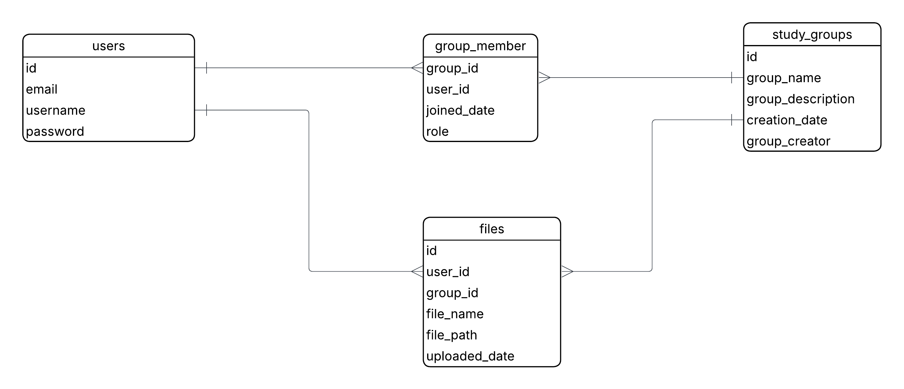

# README
## Description
- **EduVault** is a collaborative learning platform that helps students and educators organize, share, and engage with study materials more effectively. It brings together key tools in one space, making group learning seamless and productive.
### Who is EduVault for
  - **Students** working on group assignments or preparing for exams.
  - **Study groups** who want a shared space for sharing resources.
  - **Educators and tutors** who want to organize class materials.
## Setup

### Step 1
- Download and install [xampp](https://www.apachefriends.org/download.html).
- Make sure you have a browser

### Step 2
- Go to the xampp control panel and start apache and mysql

### Step 3
- Paste this url into your browser to start setting up the mysql database
```
http://localhost/phpmyadmin/index.php
```
- Go to databases and create a database called **eduvault** (you can name it whatever you like but for minimum configuration name it as this).
- Go to the new database you created and start creating these tables with the given specifications
- **NOTE**: everything is case sensitive make sure you properly name it
- The format is attribute name, data type, constraints(if any).
  
1. **users**
   - id varchar(7) (primary key)
   - email varchar(255) (unique)
   - username varhcar(20)
   - password varchar(255)
2. **study_groups**
   - id varchar(7) (primary key)
   - group_name varchar(100)
   - group_description text
   - creation_date datetime (DEFAULT(current date time))
   - group_creator varchar(7) (Foreign key refrencing an id of a user from **users** table)
3. **group_member**
   - group_id varchar(7) (Foreign key refrencing an id of a group from **study_groups** table) 
   - user_id varchar(7) (Foreign key refrencing an id of a user from **users** table)
   - joined_date datetime (DEFAULT(current date and time))
   - role enum('member', 'admin')
4. **files**
   - id varchar(7) (primary key)
   - user_id varchar(7) (Foreign key refrencing an id of a user from **users** table)
   - group_id varchar(7) (Foreign key refrencing an id of a group from **study_groups** table)
   - file_name varchar(255)
   - file_type varchar(7)
   - file_path varchar(255)
   - file_size FLOAT
   - size_type ENUM('MB', 'KB')
   - uploaded_date datetime (DEFAULT(current date and time))

- **If you chose a custom name for the database, change the specifications in *config/connect.php* found in the root directory. And if you gave any of the attributes custom names make sure to change the sql queries in the php files.**

### ER Diagram

### Step 4
- After you installation and setup go to **htdocs** which is found in the directory you installed **xampp**.

For Linux:
```bash
cd /opt/lampp/htdocs
```
### Step 5
- Clone the repository into the htdocs folder

### Step 6 
- Go to your browser and paste the following
```
http://localhost/eduvault
```
- You can now use the website, **have fun :)**


## Technologies 
- HTML
- CSS
- PHP
- JS
- XAMPP
  - MySQL
  - Apache Server


## Todo
- [x] Design the database
- [x] Make the name of the student that logged in appear on the homepage
- [x] Instead of sign in and out buttons havea an account button to logout
- [x] Link the login page with the database
- [x] make the error popups go away after clicking on them or after a certain amount of time
- [x] figure out a way for index.php to route the user based on sessions
- [x] Build study group page
  - [x] The page to show every group you are in
    - [x] figure out a way to make it dynamic !
    - [x] fix the error that prevents you from creating multiple groups at once
  - [x] popup to create a group
- [ ] pages inside each group
  - [x] edit group description
  - [x] edit group name
  - [ ] Files page
    - [x] design the page 
    - [x] upload files popup
      - [x] design
      - [x] logic
    - [ ] delete files
    - [x] download file

    - [ ] Members page
      - [x] invite members popup
      - [x] leave group
      - [x] delete group
      - [ ] kickout member


### When there is extra time
- [x] fix page reloads for invite member and create group popup
- [ ] set up fonts
- [ ] clean transitions on every clickable objects when hovered over
- [ ] implement pagination on study-groups page
- [x] code cleanup
- [ ] .htaccess file